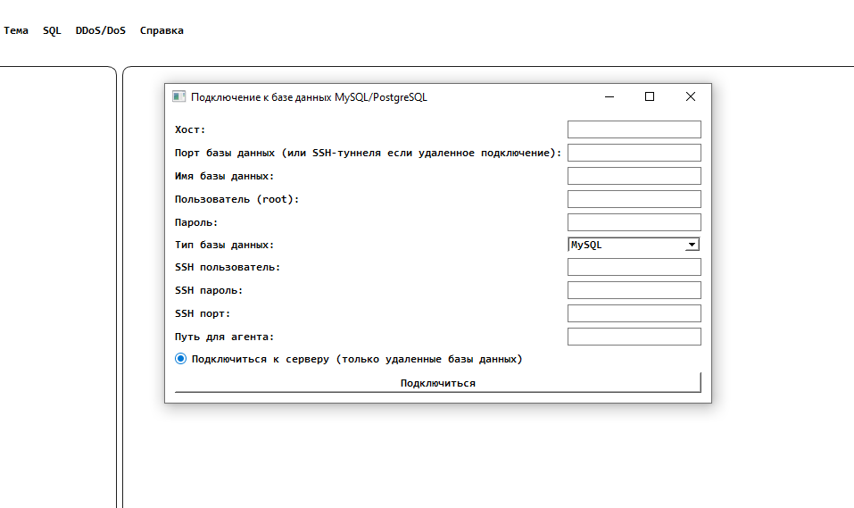
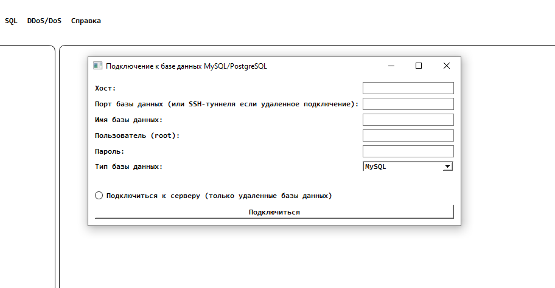
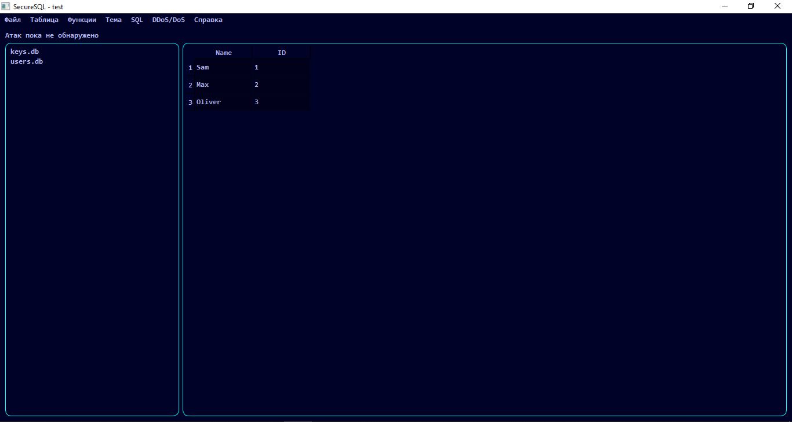
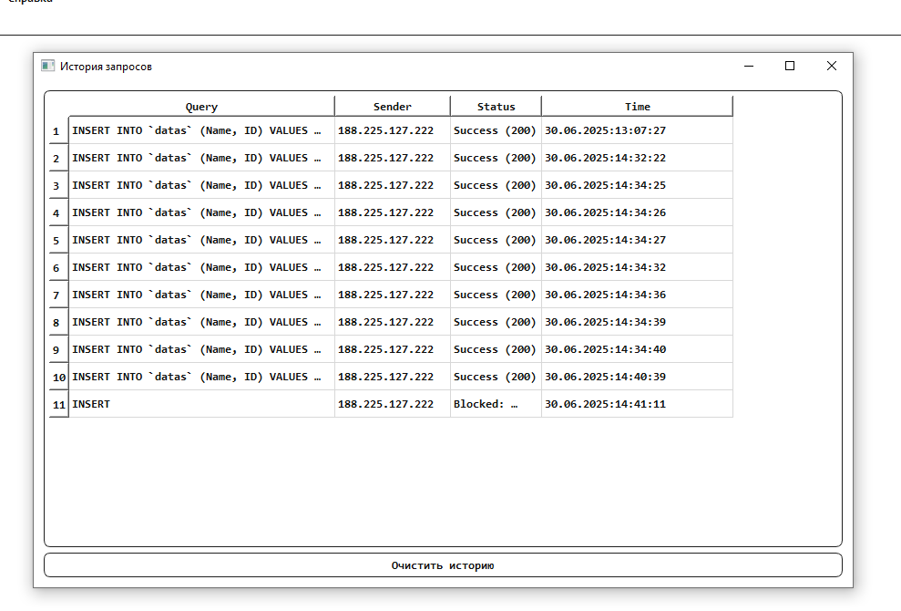

# 🛡️ SecureSQL  
**Универсальная СУБД с защитой от DDoS и SQL-инъекций для MySQL, PostgreSQL и SQLite3**  

### 🔥 Особенности  
✅ **Защита от SQL-инъекций** — автоматическая блокировка запросов из черного списка.  
✅ **Анти-DDoS** — лимит запросов, IP-фильтрация и другие методы защиты.  
✅ **Кросс-платформенность** — поддержка **SQLite, MySQL, PostgreSQL**.  
✅ **Белый список IP** — исключения для доверенных пользователей (обход ограничений).  
✅ **Телеграмм-бот для быстрого и удобного настройки системы защиты** — [@secureSQLbot].
✅ **Удобный и минималистичный дизайн** — пользователи сами могут настроить тему окна, меняя цвета отдельных элементов окна (фон, символы, таблицы и контуры).

---

## 🚀 Быстрый старт  
Для установки свяжитесь с администратором через Telegram: [@SecureSQL](https://t.me/SecureSQL).  

После загрузки установщика следуйте инструкциям:  

### 📌 Подключение к базе данных  
1. **Локальная база (SQLite)**:  
   - Выберите файл базы данных через интерфейс.  
2. **Удаленная база (MySQL/PostgreSQL)**:  
   - Заполните параметры подключения во вкладке **"Файл"**.  
   - Для подключения к удаленной базе данных (облачной) укажите дополнительные данные для SSH-подключения.  
3. **SSH-туннель**:  
   - Обязательно настройте туннель для работы с удаленными серверами.  

### 🛡️ Системы защиты: алгоритм работы и ее структура агента
1. **Установка зависимостей**
   - После подключения к базе данных система устанавливает необходимые библиотеки, файлы и создает виртуальную среду для агента
2. **Создание сервиса**
   - Система создает сервис, который запускает агента. Агент создает прокси-сервер на вашем сервере на указанном порту (по умолчанию 1400) и принимает запросы или данные по адресам, которые были указаны при настройки системы защиты
3. **Алгоритм работы**
   - Запрос отправляется на прокси-сервер на указанный адрес. Проки-сервер обрабатывает запрос и проверяет на безопасность (SQL-инъекция и DDoS). После проверки, система отправляет запрос на базу данных и возвращает ответ (если запрос на подобии INSERT, DELETE, UPDATE, то ответом будет статус ({'result':'success'}). Если же запрос типа SELECT, к ответу добавляется результат ({'result':'success', 'fetch':[данные]}))
---

## 🖥️ Интерфейс SecureSQL  

### 1. Подключение к базе данных  
  
*Настройка SSH, выбор СУБД (MySQL/PostgreSQL) и аутентификация.*  

  
*Подключение СУБД к базе данных(MySQL/PostgreSQL) и аутентификация.*  

### 2. Рабочее окно (пользовательская тема)  
  
*Просмотр таблиц и мониторинг активности.*  

### 3. История запросов  
  
*SQL-запросы с отметками времени, отправителем, запросом и статусами (успешно/заблокировано).*  

---

## ⚠️ Ограничения  
Некоторые функции доступны только для удаленных серверов:  
- Защита от DDoS/DoS-атак.  
- Блокировка SQL-инъекций.  
- Управление белым списком IP.  
- История и мониторинг запросов.  

> 🔥 **В будущих обновлениях:**  
> - Расширение защиты (шифрование, ИИ-анализ атак).  
> - Поддержка новых СУБД.  
> - Оптимизация существующих модулей.  
> - Облегчение интеграции системы

---

## 📌 Примечания  
- Для работы с локальными базами (SQLite) часть функций недоступна.  
- Рекомендуется использовать последнюю версию SecureSQL.  

# 🚀 Приятной работы!  
